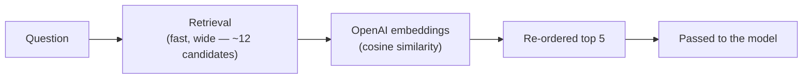

# 07. Re-ranking

## The idea

Retrieval is built for **speed** across thousands of chunks, so it's a bit
rough. Re-ranking takes the shortlist retrieval returned and sorts it again
using cosine similarity between OpenAI embeddings for the question and each
candidate chunk.

This adds an embedding request for the shortlist without a separate
reranking service.



## How it works here

- Retrieval pulls a **wide** shortlist (`RERANK_CANDIDATE_K = 12`).
- `rerank_with_scores()` embeds the question and candidate chunks with
  `text-embedding-3-small`, then ranks them by cosine similarity.
- The top `TOP_K_RESULTS = 5` go to the model.

```python
from hr_assistant.reranker import rerank

candidates = get_retriever(vector_store, k=12).invoke(
    "Can I take annual leave right before my last day?"
)
top = rerank("Can I take annual leave right before my last day?", candidates, top_n=5)
```

The reranker also returns a **relevance score** per chunk. The guarded
search tool — which every real code path now uses, the deployed app
included — uses that score as a cutoff: if the best chunk scores below a
threshold, the tool reports "not found" instead of returning a weak match
(doc 15).

## Watch out for

- Re-ranking can only re-order what retrieval already found — it can't
  bring back a chunk retrieval missed.
- Only re-rank a modest shortlist (10–20), never the whole store — each
  candidate is sent to the embeddings API.

Next: **[doc 08 — The Agent](08-the-agent.md)**.
