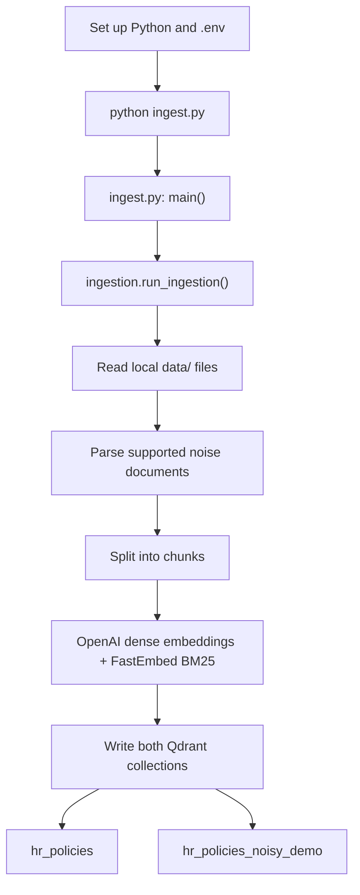
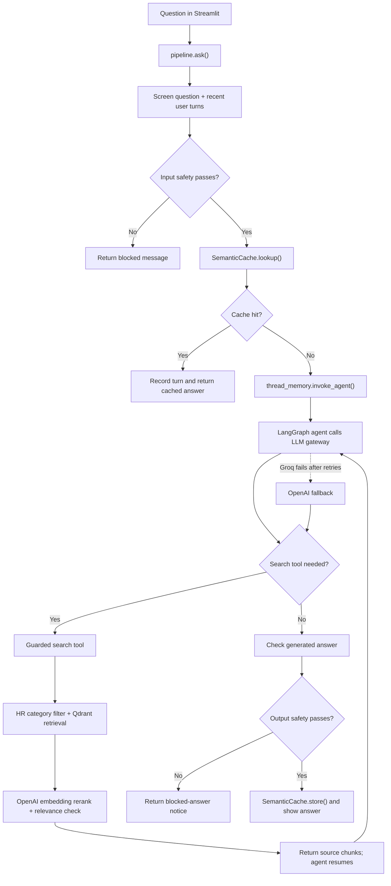
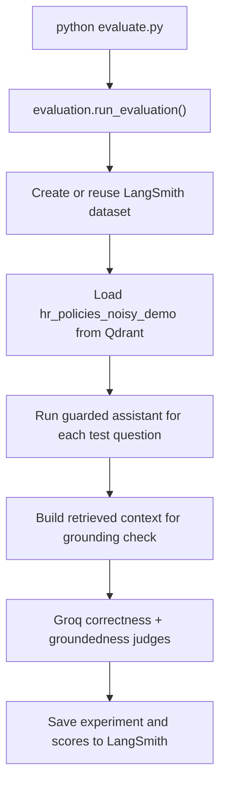

# Run the HR Policy Assistant

## 1. Requirements and Setup

Use Python 3.11 or newer. From the project root in PowerShell:

```powershell
py -m venv venv
.\venv\Scripts\Activate.ps1
python -m pip install --upgrade pip
pip install -r requirements.txt
Copy-Item .env.example .env
```

Open `.env` and set the keys and endpoints:

| Setting | Required for | Purpose |
|---|---|---|
| `GROQ_API_KEY` | App, ingestion, evaluation | Primary Groq chat model and evaluation judge |
| `OPENAI_API_KEY` | App, ingestion | OpenAI fallback chat model, safety fallback, and embeddings |
| `QDRANT_URL` | App, ingestion, evaluation | Qdrant Cloud cluster URL |
| `QDRANT_API_KEY` | App, ingestion, evaluation | Qdrant Cloud access |
| `LANGSMITH_API_KEY` | Optional for app; required for evaluation | LangSmith datasets, experiments, and optional tracing |

`config.check_api_keys()` checks Groq, OpenAI, and Qdrant settings when the assistant is built. Groq is the primary chat model; OpenAI is used for fallback and embeddings. LangSmith tracing is off by default; enable it with `LANGSMITH_TRACING=true`.

Do not commit `.env` or paste API keys into source files.

## 2. Ingest the Documents

Run ingestion before using the app for the first time:

```powershell
python ingest.py
```

The ingestion process reads source files from `data/`, parses supported PDF/DOCX/PPTX noise files, chunks the text, creates OpenAI embeddings, and writes to two Qdrant Cloud collections:

- `hr_policies`: HR policies only.
- `hr_policies_noisy_demo`: HR policies plus the mixed/noise corpus.

Useful options:

```powershell
python ingest.py --force       # delete and rebuild both collections
python ingest.py --hr-only     # build only the clean HR collection
python ingest.py --noisy-only  # build only the HR + noise collection
```

`--force` replaces existing collection contents. Use it after changing the embedding model or when you need to refresh the corpus. Normal ingestion skips populated collections.

### Startup and Ingestion Flow

Run `python ingest.py` before starting the app for the first time:



## 3. Start the Application

```powershell
streamlit run app.py
```

Open the local URL printed by Streamlit, normally `http://localhost:8501`. If that port is busy:

```powershell
streamlit run app.py --server.port 8502
```

At startup, `app.py:get_agent()` calls `pipeline.build_hr_assistant()`. It
connects to `hr_policies`; if that collection is missing, it runs HR
ingestion once automatically.

### Chat Request Flow



The agent may call the search tool more than once. A cache hit skips the
agent and output-screening steps.

The app can also be run from the CLI:

```powershell
python main.py
```

## 4. Evaluation and Security Checks

### Answer-quality evaluation

Ensure both Qdrant collections are ingested, then run:

```powershell
python evaluate.py
```

### Evaluation Flow



This evaluates the agent against `hr_assistant/evaluation_dataset.py` test cases for correctness and groundedness. It uses Groq's judge model and LangSmith to create or reuse the `hr-policy-qa-gcpp` dataset and record an experiment. This sends evaluation data and model requests to those hosted services; it is not an offline test.

### Red-team checks

```powershell
python redteam_test.py
```

This compares the guarded assistant against a plain baseline using adversarial prompts. Results are written under `results/`.

## 5. Guardrails and Request Flow

The normal request path is `hr_assistant.pipeline.ask()`:

1. `thread_memory.input_text_for_screening()` combines the current question with configured recent user turns.
2. `guardrails.check_input()` calls the OpenAI structured-output safety classifier. Unsafe prompts are refused before retrieval. Input screening fails closed by default.
3. `SemanticCache.lookup()` checks for a similar recent question.
4. The LangGraph agent searches with `tools.create_guarded_search_tool()`.
5. `guardrails.check_output()` screens the generated answer. Output screening fails open by default if the provider errors.
6. `SemanticCache.store()` stores successful answers.

The scope guardrail is separate from the OpenAI safety classifier. `create_guarded_search_tool()` filters retrieval to `config.HR_POLICY_CATEGORIES` and rejects results below `config.RELEVANCE_THRESHOLD`.

Configuration:

- `GUARDRAIL_PROVIDER=openai` is the default. Set it to `none` to disable input/output safety classification.
- `GUARDRAIL_FAIL_OPEN_INPUT=false` means provider errors block the request; set `true` only if you explicitly want input to fail open.
- `GUARDRAIL_FAIL_OPEN_OUTPUT=true` allows the answer through if output screening errors; set `false` to block it instead.
- `GUARDRAIL_HISTORY_TURNS` controls how many recent user turns are included in input screening.

## 6. Embeddings and Retrieval

- `hr_assistant/embeddings.py` — `get_embeddings_model()` creates `OpenAIEmbeddings` using `config.EMBEDDING_MODEL_NAME` (default `text-embedding-3-small`).
- `hr_assistant/vector_store.py` — `build_vector_store()` embeds and writes chunks; `load_vector_store()` connects to existing collections; `get_retriever()` performs filtered retrieval. Dense vectors use OpenAI embeddings; sparse keyword vectors use local FastEmbed BM25 (`Qdrant/bm25`).
- `hr_assistant/reranker.py` — `rerank_with_scores()` embeds the query and candidate chunks with the same OpenAI embedding model and orders them by cosine similarity; `rerank()` returns only the reordered documents.
- `hr_assistant/semantic_cache.py` — `SemanticCache.lookup()` and `SemanticCache.store()` use the same embedding model for semantic cache matching.

Changing `EMBEDDING_MODEL_NAME` changes vector dimensions or vector semantics. Rebuild both collections with `python ingest.py --force` before running the app.

## 7. LLM Gateway and Providers

All agent and safety-check model calls go through `hr_assistant/llm.py`:

- `get_llm()` returns a `ChatLiteLLMRouter` LangChain chat model.
- `_get_router()` configures LiteLLM's in-process `Router`.
- Primary: Groq, default `openai/gpt-oss-20b` (`LLM_MODEL_NAME`).
- Fallback: OpenAI, default `gpt-4o-mini` (`FALLBACK_MODEL_NAME`), after two primary retries. Requires `OPENAI_API_KEY` to work.
- Evaluation judge: Groq, default `openai/gpt-oss-120b` (`JUDGE_MODEL_NAME`).

LiteLLM is an SDK running inside this Python process; the project does not require a separate LiteLLM proxy server.

## 8. Main Project Components

| Component | Files and key functions | Responsibility |
|---|---|---|
| Streamlit UI | `app.py`, `get_agent()` | Chat interface and session state |
| CLI | `main.py` | Terminal chat interface |
| Ingestion | `ingest.py`; `hr_assistant/ingestion.py`: `run_ingestion()`, `ingest_hr_policies()`, `ingest_noisy_corpus()` | Load local corpus and build Qdrant collections |
| Document loading/parsing | `hr_assistant/document_loader.py`: `load_documents_from_local()`, `load_processed_documents_from_local()`; `hr_assistant/processor.py`: `process_raw_to_json()` | Read local documents and parse supported formats |
| LLM gateway | `hr_assistant/llm.py`: `get_llm()`, `_get_router()` | Groq primary and OpenAI failover |
| Safety guardrails | `hr_assistant/guardrails.py`: `check_input()`, `check_output()` | OpenAI safety classification with configurable failure behavior |
| Embeddings | `hr_assistant/embeddings.py`: `get_embeddings_model()` | OpenAI document/query vectors |
| Vector database | `hr_assistant/vector_store.py`: `build_vector_store()`, `load_vector_store()`, `get_retriever()` | Qdrant Cloud hybrid search and metadata filters |
| Search and scope | `hr_assistant/tools.py`: `create_guarded_search_tool()` | Retrieval, reranking, HR category allow-list, relevance cutoff |
| Reranking | `hr_assistant/reranker.py`: `rerank_with_scores()`, `rerank()` | OpenAI embedding cosine similarity |
| Semantic cache | `hr_assistant/semantic_cache.py`: `SemanticCache.lookup()`, `store()` | In-memory similar-question response cache |
| Evaluation | `evaluate.py`; `hr_assistant/evaluation.py`: `run_evaluation()` | LangSmith experiment with Groq judging |
| Red team | `redteam_test.py` | Security/adversarial regression suite |

## 9. Services Used

- **Groq API:** primary chat and evaluation judge.
- **OpenAI API:** fallback chat, embeddings, and safety classification.
- **Qdrant Cloud:** persistent vector collections.
- **LangSmith:** optional tracing; required by the current evaluation workflow.
- **FastEmbed:** local sparse BM25 search model.
- **Google Cloud:** not used by the active application runtime.
